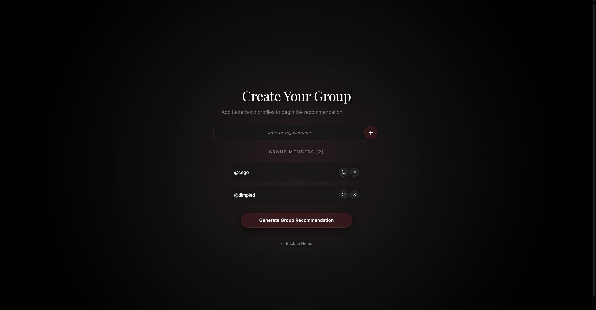
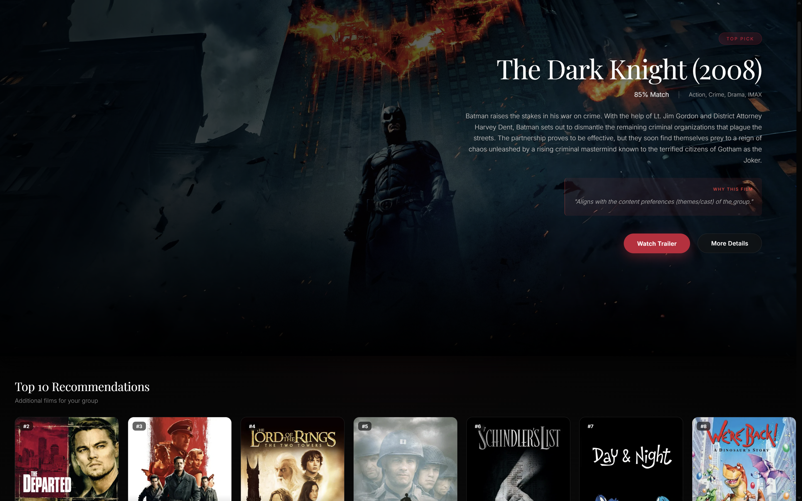
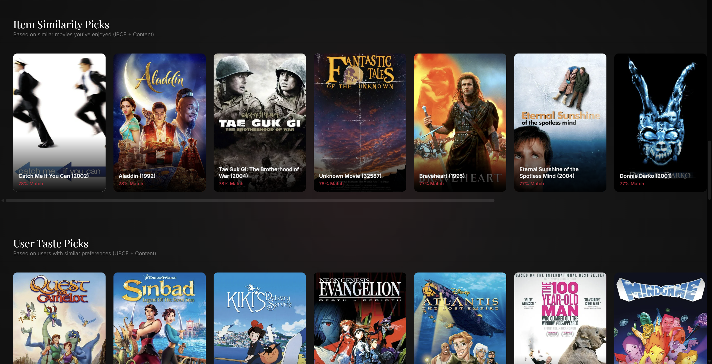

# 🎬 Group Movie Recommendation System

A sophisticated group movie recommendation system that combines collaborative filtering, content-based filtering, and watchlist analysis to generate personalized recommendations for groups of users.

## 📋 Table of Contents

- [Features](#features)
- [System Architecture](#system-architecture)
- [Installation](#installation)
- [Quick Start](#quick-start)
- [Project Structure](#project-structure)
- [Models](#models)
- [Configuration](#configuration)
- [Contributing](#contributing)

## ✨ Features

### Core Functionality
- **Multi-Model Hybrid Recommendation**: Combines three hybrid models (H1, H2, H3) for optimal results
- **Group Recommendation**: Specialized algorithms for recommending movies to groups
- **Watchlist Integration**: Leverages user watchlists for enhanced recommendations
- **AI-Powered Filtering**: Natural language movie filtering using Gemini AI
- **Temporal Preference Analysis**: Considers users' historical viewing patterns
- **Explainable Recommendations**: Provides detailed explanations for each recommendation

## 📸 Screenshots

### Home Page

*Group users selection page*

### Recommendation Results





> **Note**: To add screenshots, place your images in the `docs/images/` folder and update the paths above.


## 🏗️ System Architecture

```
┌─────────────────────────────────────────────────────────────┐
│                     Frontend (React + Vite)                  │
│                  Modern UI with Tailwind CSS                 │
└──────────────────────┬──────────────────────────────────────┘
                       │ REST API
┌──────────────────────▼──────────────────────────────────────┐
│                  Backend (Flask + Python)                    │
│  ┌──────────────────────────────────────────────────────┐   │
│  │              Recommendation Pipeline                  │   │
│  │  ┌────────────┐  ┌────────────┐  ┌────────────┐     │   │
│  │  │  Hybrid 1  │  │  Hybrid 2  │  │  Hybrid 3  │     │   │
│  │  │ (IBCF+CBF) │  │ (UBCF+CBF) │  │(Watchlist) │     │   │
│  │  └────────────┘  └────────────┘  └────────────┘     │   │
│  │         │               │               │            │   │
│  │         └───────────────┴───────────────┘            │   │
│  │                     │                                │   │
│  │              Ensemble Aggregation                    │   │
│  │                     │                                │   │
│  │         ┌───────────▼───────────┐                    │   │
│  │         │  AI Filter (Optional) │                    │   │
│  │         └───────────┬───────────┘                    │   │
│  │                     │                                │   │
│  │         ┌───────────▼───────────┐                    │   │
│  │         │ Structured Output Gen │                    │   │
│  │         └───────────────────────┘                    │   │
│  └──────────────────────────────────────────────────────┘   │
└──────────────────────┬──────────────────────────────────────┘
                       │
┌──────────────────────▼──────────────────────────────────────┐
│                    Data Layer                                │
│  ┌──────────┐  ┌──────────┐  ┌──────────┐  ┌──────────┐   │
│  │ MovieLens│  │  TMDB    │  │Watchlists│  │  Cache   │   │
│  │   Data   │  │Metadata  │  │   Data   │  │  Layer   │   │
│  └──────────┘  └──────────┘  └──────────┘  └──────────┘   │
└─────────────────────────────────────────────────────────────┘
```

## 🚀 Installation

### Prerequisites
- Python 3.8+
- Node.js 16+
- Git

### Backend Setup

1. **Clone the repository**
```bash
git clone <repository-url>
cd group_movie_recommendation_systems
```

2. **Create virtual environment**
```bash
python -m venv venv
source venv/bin/activate  # On Windows: venv\Scripts\activate
```

3. **Install dependencies**
```bash
pip install -r requirements.txt
```

4. **Configure environment variables**
```bash
cp .env.example .env
# Edit .env and add your GEMINI_API_KEY
```

5. **Prepare data** (if needed)
```bash
# Clean duplicate movies
python src/utils/data_cleanup.py

# Merge watchlist files
python src/utils/watchlist_merger.py
```

### Frontend Setup

1. **Navigate to frontend directory**
```bash
cd frontend
```

2. **Install dependencies**
```bash
npm install
```

3. **Build frontend**
```bash
npm run build
```

## ⚡ Quick Start

### Option 1: Start Everything (Recommended)
```bash
# Windows
start_all.bat

# Linux/Mac
./start_all.sh
```

This will start both backend and frontend servers.

### Option 2: Start Manually

**Backend:**
```bash
python src/main.py
# Server runs on http://localhost:5000
```

**Frontend (Development):**
```bash
cd frontend
npm run dev
# Server runs on http://localhost:5173
```

**Frontend (Production):**
```bash
cd frontend
npm run build
# Served by Flask backend at http://localhost:5000
```

### Access the Application
Open your browser and navigate to:
- **Development**: http://localhost:5173
- **Production**: http://localhost:5000

## 📁 Project Structure

```
group_movie_recommendation_systems/
├── 📂 src/                          # Backend source code
│   ├── 📂 recommender/              # Recommendation models
│   │   ├── 📂 UBCF/                 # User-Based Collaborative Filtering
│   │   ├── 📂 IBCF/                 # Item-Based Collaborative Filtering
│   │   ├── 📂 CBF/                  # Content-Based Filtering
│   │   └── 📂 hybrid/               # Hybrid models (H1, H2, H3)
│   ├── 📂 pipeline/                 # Recommendation pipeline
│   ├── 📂 routes/                   # Flask API routes
│   ├── 📂 agents/                   # AI filtering agents
│   ├── 📂 calibration/              # Model weight optimization
│   ├── 📂 experiments/              # Experimental scripts
│   │   ├── 📂 optimization/         # Parameter optimization
│   │   ├── 📂 evaluation/           # Model evaluation
│   │   ├── 📂 visualization/        # Result visualization
│   │   ├── 📂 results/              # Experiment results & plots
│   │   │   ├── 📂 item_based_cf/    # ItemCF findings
│   │   │   ├── 📂 user_based_cf/    # UBCF findings
│   │   │   ├── 📂 hybrid/           # Hybrid model optimization
│   │   │   ├── 📂 watchlist/        # Watchlist evaluations
│   │   │   ├── 📂 comparison/       # Cross-model comparisons
│   │   │   └── 📂 scripts/          # Visualization scripts
│   │   ├── 📂 single_models/        # Individual model tests
│   │   ├── 📂 archive/              # Legacy scripts
│   │   └── evaluation_config.py     # Evaluation configuration
│   ├── 📂 utils/                    # Utility functions
│   └── main.py                      # Flask application entry point
│
├── 📂 frontend/                     # React frontend
│   ├── 📂 src/
│   │   ├── 📂 components/           # React components
│   │   ├── 📂 pages/                # Page components
│   │   └── App.jsx                  # Main app component
│   ├── package.json
│   └── vite.config.js
│
├── 📂 data/                         # Data files
│   ├── movies_tmdb.csv              # Movie metadata
│   ├── ratings.csv                  # User ratings
│   ├── watchlist.csv                # User watchlists
│   └── 📂 splits/                   # Train/validation/test splits
│
├── 📂 cache/                        # Cached models and matrices
├── 📂 config/                       # Configuration files
├── 📂 demos/                        # Demo scripts
├── 📂 reports/                      # Generated reports
│
├── requirements.txt                 # Python dependencies
├── .env.example                     # Environment variables template
├── start_all.bat                    # Windows startup script
└── README.md                        # This file
```

## 🤖 Models

### Hybrid Model 1 (Dynamic Weighted)
- **Components**: Item-Based CF + Content-Based Filtering
- **Strategy**: Dynamic trust factor (C) balances collaborative and content signals
- **Optimal Config**: C=1.0, Average aggregation
- **Use Case**: Best for groups with diverse tastes

### Hybrid Model 2 (Weighted Linear)
- **Components**: User-Based CF + Content-Based Filtering
- **Strategy**: Linear weighted combination
- **Optimal Config**: w_ubcf=0.20, w_cbf=0.80, Least Misery aggregation
- **Use Case**: Best for groups prioritizing fairness

### Hybrid Model 3 (Watchlist-Based)
- **Components**: Content-Based Filtering + Watchlist Analysis
- **Strategy**: Leverages explicit user interest signals
- **Use Case**: Best when users have well-maintained watchlists

### Ensemble Strategy
The system combines all three models using performance-based weights:
- Weights are calculated based on NDCG@10 scores
- Stored in `data/model_artifacts/ensemble_weights.json`

## ⚙️ Configuration

### Environment Variables (.env)
```bash
# Required
GEMINI_API_KEY=your_gemini_api_key_here

# Optional
FLASK_ENV=production
FLASK_DEBUG=0
PORT=5000
```

### Model Configuration (src/experiments/evaluation_config.py)
```python
OFFLINE_EVAL_CONFIG = {
    'normalization': 'zscore',
    'item_k': 60,              # Item neighbors
    'user_k': 20,              # User neighbors
    'hybrid_weight_C': 1.0,    # Trust factor for H1
    'num_groups': 30,          # Test groups
    # ... more parameters
}
```

## 📝 License

This project is developed for academic purposes.

## 👥 Authors

- Ceren Adıyaman
- Gamze Dağ

## 🙏 Acknowledgments

This study has been done in the frame of Eskişehir Osmangazi University 152117117 Introduction to Recommender Systems course by the supervision of Asst. Prof. Savaş Okyay.   

